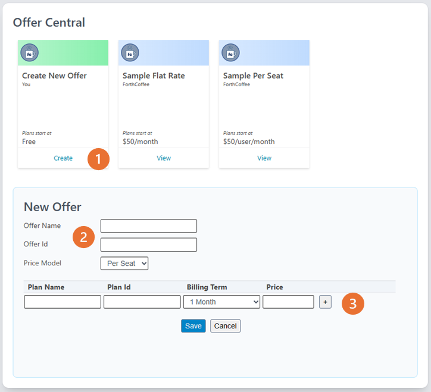
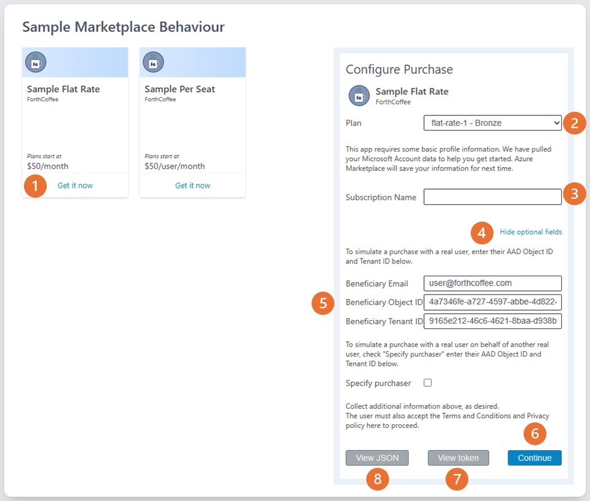

# Challenge 01 - Emulate! - Coach's Guide

[< Previous Solution](./Solution-00.md) - **[Home](./README.md)** - [Next Solution >](./Solution-02.md)

## Notes & Guidance

**Using the emulator**
- navigate to the Emulator in a browser - `https://localhost:3978`

**Creating an offer**  
- go to the **Offers** page  

- click **Create Offer** (you can also select and clone an existing offer)
  1. enter the Name and Id - the Id must be unique - and select the pricing model
  2. multiple plans can be added to an offer using the **+** button
  3. click **Save**
- the new offer will be available in the Emulator Marketplace

**Making a Purchase**  
The Marketplace product boxes are based on the real Marketplace, populated with built in and customer offers.
- go to the **Marketplace** page  
  
  1. click **Get it now** to select an offer - the details will appear in the purchase tile to the right
  2. select the plan from the dropdown
  3. The Subscription Name is a friendly name for the subscription / purchase - advise students to use a unique, memorable name
  4. Hide optional fields will be needed later in the hack, it presents the additional fields, options
  5. Fields needed for a later challenge, but can be used now
  6. Click **Continue** to make the order and post to the Landing Page
  7. **View token** to see the synthetic token; this could be decoded to view the details: [GCHQ's CyberChef](https://gchq.github.io/CyberChef/) 
  8. **View JSON** to see the JSON payload - this is cutdown from the real payload 

**Confirming the Purchase**  
The **Landing Page** is a *required*, simple web page that confirms the purchase details and the option for the ISV to collect additional information.
- go to the **Landing Page** page

  1. The purchase details are displayed, based on the offer / plan selected in the Marketplace
  2. The ISV can choose to collect additional details from the customer
  3. Activate the subscription to completes the purchase

**Managing Subscriptions**  
- go to the **Subscriptions** page

  1. The subscriptions can be identified by the Name - set in the Marketplace at the point of *purchase*
  2. Subscription Ids can be copied to the clipboard using the icon to the right, if needed
  3. The subscription state can be changed using the buttons, which will vary on the current state of the subscription

**Updating the Emulator Configuration**
There will be certain points in the hack where the emulator configuration will need to be updated, and only 3 settings.
- go to the **Config** page - after each change click **Set** to save

  1. The Landing Page URL - in **Challenge 2**  the port setting should only be changed to 3000 but the simplest method for the student is to copy the URL from the Sample App Landing Page, once that is running
  2. The Webhook URL - in **Challenge 6** should be a change to port `...:3000/api/webhook` (the base URL should match that of the Landing Page URL)
  3. Marketplace Auth needs to be turned on in **Challenge 8**
  4. If for some reason the students gets in a pickle they can clear out the Subscriptions and Offers using the **Clear** button

**Troubleshooting:**
If the emulator is running and there is a problem with the emulator operations check the student's config settings on the URL / port settings - if they have followed the setup properly they should match the screenshot.

