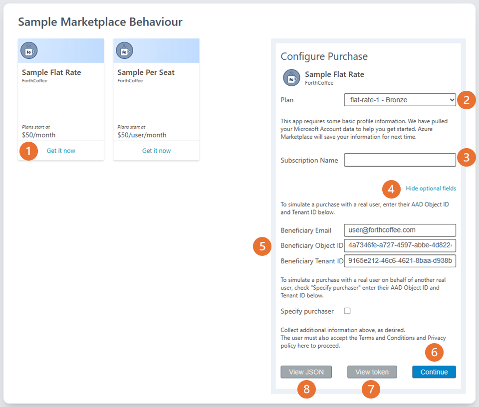

# Challenge 07 - Landing page Single Sign On - Coach's Guide 

[< Previous Solution](./Solution-06.md) - **[Home](./README.md)** - [Next Solution >](./Solution-07.md)

## Notes & Guidance

In the Azure portal the student will need to create a new **App Registration**, in Active Directory:
- create as Multitenant
- create a Single Page Application
- set the Redirect URI to: 
    - `https://localhost:3000/landing.html`
    - `https://localhost:3000/saas.html`
- copy the **Application (client) ID** and **Directory (tenant) ID** to the `.env` file
- add the redirect URI to the `.env` file

The above is all that is required for the configuration track

The code challenge updates the client files: `src/client/landing.html` and `/saas.html`

The suggested code is listed below, this is the same for both files:

        // -- START REMOVE FOR CODE PATH -- //
        const pca = new msal.PublicClientApplication({
            auth: {
              clientId: config.clientId
            },
            cache: {
              cacheLocation: "localStorage"
            }
        });
        // -- END REMOVE FOR CODE PATH -- //
        
        async function signInClick() {
          
          // -- START REMOVE FOR CODE PATH -- //
          await pca.loginRedirect({
            scopes: [],
            redirectUri: `${config.redirectBaseUri}/landing.html`
          });

          return;
          // -- END REMOVE FOR CODE PATH -- //
          
          setUI('user', 'Not implemented', true);
        }

        // -- START REMOVE FOR CODE PATH -- //
        const result = await pca.handleRedirectPromise();

        if (result != null) {
          const accessToken = result.accessToken;

          const claims = parseJwt(accessToken);

          setUI('user', `Access Token: ${accessToken}\n\nTenant ID (tid): ${claims.tid}\nUser ID (oid): ${claims.oid}\nEmail (unique_name): ${claims.unique_name}`, true);
          setValue('user', accessToken);
        }
        // -- END REMOVE FOR CODE PATH -- //

**Troubleshooting:**
- The configuration above should be correct if the student has followed the setup instructions, if not the sample app URL may be different.
- When making a purchase in the Emulator the student needs to use **4** to show the optional fields and in **5** enter the email address and Tenant ID they're signing in with in the sample app.
  
  - If the student needs to find their Tenant ID they can use the portal, [What is my Tenant ID](https://www.whatismytenantid.com/)
- If the authentication fails and the solution is configured correctly **and** the student is using WSL check the time on the WSL clock, type `date` in the WSL terminal.
If the WSL clock is out of sync with the Windows clock run the following command in the WSL terminal:
`sudo hwclock -s`. Check the time again with `date` and retry the authentication.