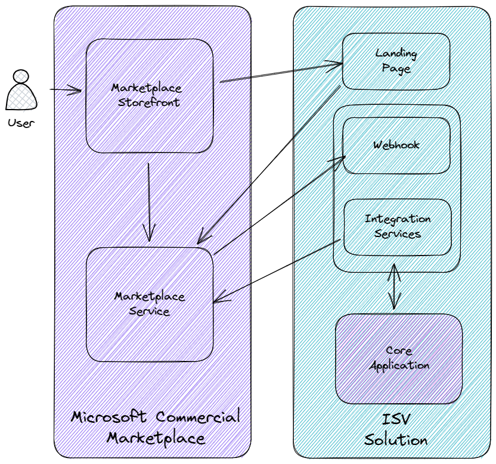

# Challenge 02 - Creating a landing page

[< Previous Challenge](./Challenge-01.md) - **[Home](../README.md)** - [Next Challenge >](./Challenge-03.md)

## Pre-requisites

You must have **installed the Sample App**

## Introduction

There are 4 principal actors in the process that manages the lifecycle of transactable SaaS offers in the marketplace:

- The Marketplace itself (and the storefront the user interacts with eg the Azure portal, AppSource)
- A landing page for your solution for new customer onboarding
- A webhook for your solution to listen for messages from the marketplace
- An "integration services" component that can call marketplace APIs on behalf of your application

We will cover all these areas in this *What The Hack*. In this challenge we will start with the landing page which is critical to the new customer onboarding experience.

When a customer indicates their intention to purchase your solution in the marketplace, they are directed to your
landing page. The query string contains a token that is used to understand some basic details about the customer and
their desired purchase. The landing page is also your opportunity to capture any additional information as part of the
onboarding journey and confirm the customer's purchase.

## Description

In this challenge you will configure an initial landing page for your solution to extract a value from the query string, which would be a marketplace token in a live environment (or synthetic token from the Emulator).

The sample application provided by the coach includes the Landing Page - `landing.html`.  
**Note:** The sample app and code are marked to the respective challenge, ignore any lower than the current challenge number.

**Configuration Tracks**
- Load the sample app Landing Page
- Update the URL to add the variable `?token` with a value of `my-token`

**Code Track**
There are a number of JavaScript methods in `landing.html` (in src/client). In this challenge we will only be concerned with the
function `queryButtonClick()` which has an empty implementation.

Your task is to update the function `queryButtonClick()` in `landing.html` to:
- Extract the query parameters from the URL
- Extract the value of the query string parameter `token`
- Assign that value to the variable `token` (already declared at block scope)
- Set the text property of the HTML element with id `my-token` to the value of the `token` variable

## Success Criteria

To complete this challenge successfully, you should be able to:
- Verify that your landing page ("What The Hack - Landing Page") displays
- Change the URL to add the token
- Verify that "my-token" is displayed in the landing page box labelled Challenge 01.

## Learning Resources

- [Build the landing page for your transactable SaaS offer in the commercial marketplace](https://learn.microsoft.com/azure/marketplace/azure-ad-transactable-saas-landing-page)
- [Managing the SaaS subscription life cycle](https://learn.microsoft.com/azure/marketplace/partner-center-portal/pc-saas-fulfillment-life-cycle)
- [How can I get query string values in JavaScript?](https://stackoverflow.com/questions/901115/how-can-i-get-query-string-values-in-javascript)
- [URLSearchParams at MDN](https://developer.mozilla.org/docs/Web/API/URLSearchParams)
